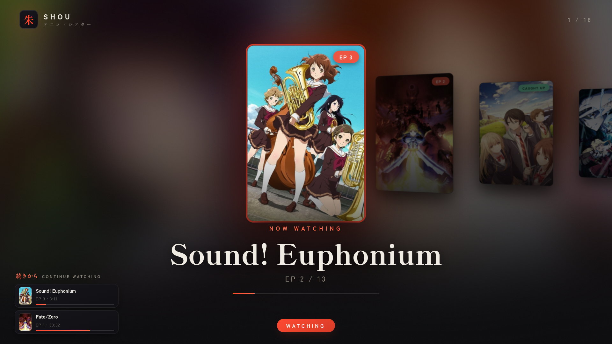
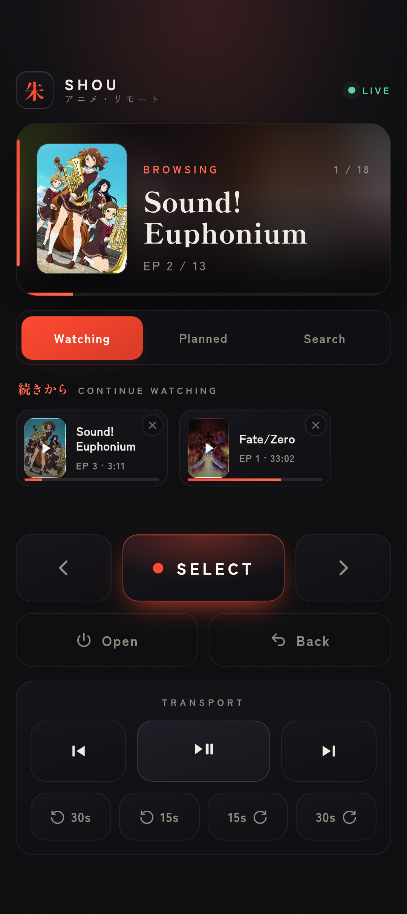
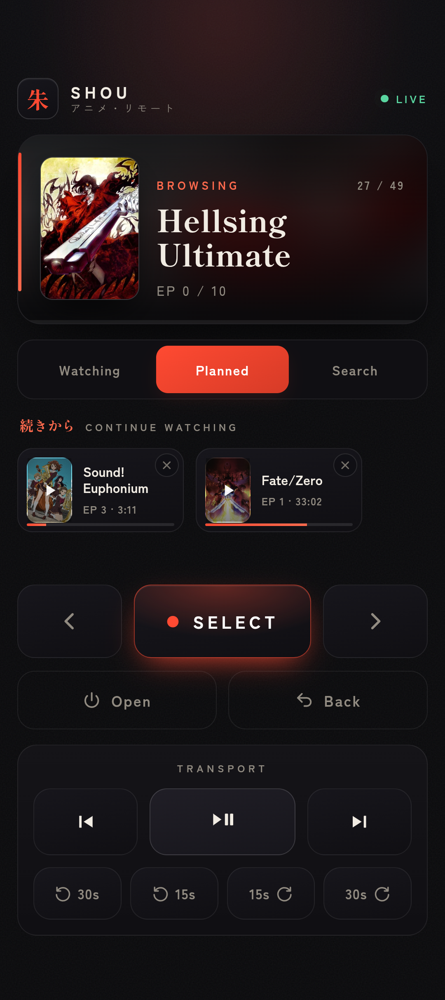
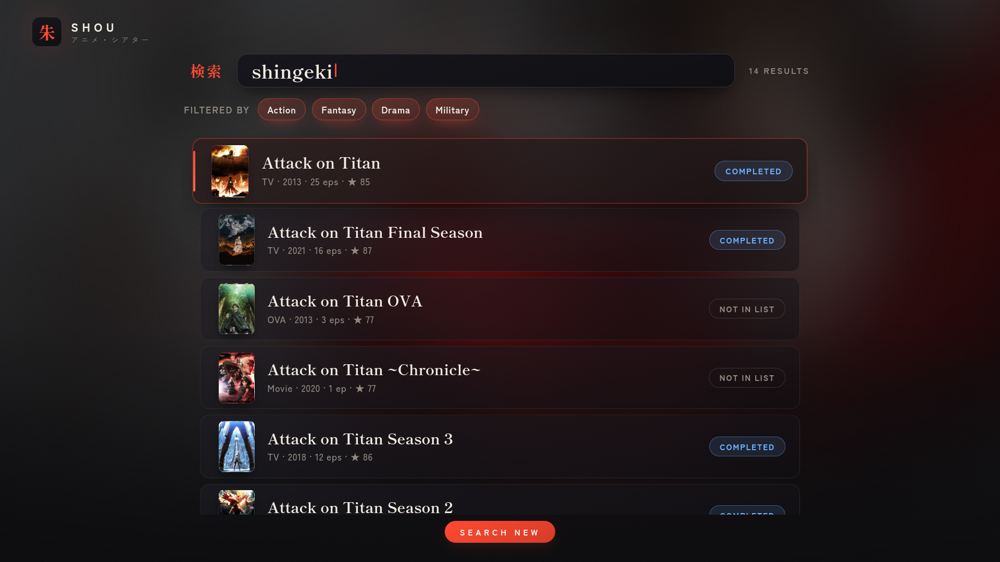
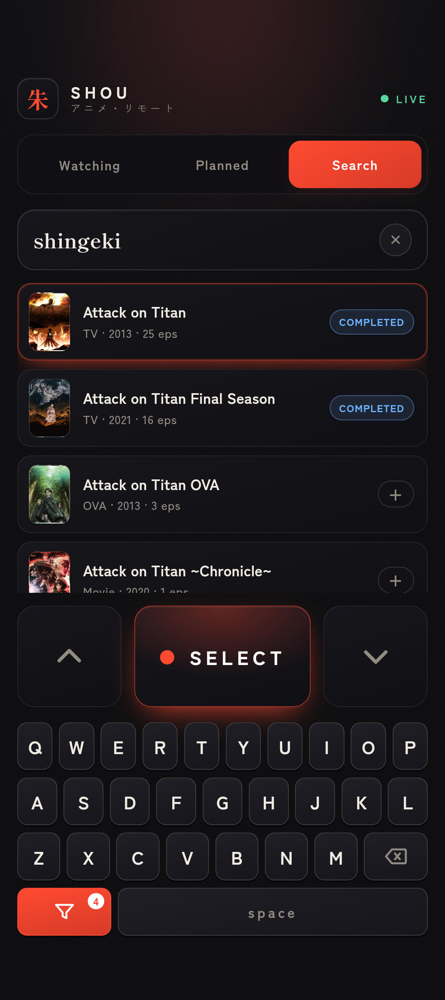
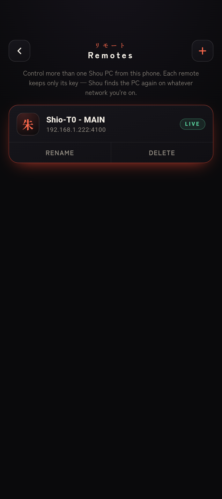

# 🎌 Shou [ LINUX ]

[](LICENSE.md)
[](#requirements)
[](#windows)

On **Windows**? There's a [`windows` branch](#windows) with its own installer.
On **MacOS**? There's a [`MacOS` branch](#macos) with its own installer.

**Watch your anime entirely from your phone.** Shou puts your AniList list on the big
screen and lets you browse, play, resume, rate, and even *grow* your list from a beautiful
phone remote — you never touch the computer. The couch is the only required peripheral.

A long-running Flask + SocketIO server is the single brain. It fetches your public AniList
list, shows a cinematic 3D-coverflow **kiosk** (a fullscreen browser window) on the PC, and
serves a touch-first **phone web-remote (PWA)** that mirrors the kiosk live over WebSocket.
Pick an anime and it auto-plays your next unwatched episode through the `anipy` scrapers →
`mpv` (fullscreen), or through `ani-cli` if you have it. Everything you do on the phone
shows up on the TV instantly, and vice-versa — and you can even **throw the playing episode
onto your phone** mid-watch and toss it back to the PC right where you left off. The remote
is a **PWA**, but there's also an optional **native Android app** that keeps your screen
awake and finds the PC by itself.

Runs on **most Linux distros** (Arch, Debian/Ubuntu, Fedora, openSUSE, Void, Alpine, …) and
any desktop/compositor — it needs only `mpv`, a browser, `curl`, and `uv`. Playback control
reaches mpv over its own IPC socket, so there's **no `playerctl`/`mpv-mpris` requirement**.

---

## What you can do

- 🎞️ **Browse your lists** — your *Currently Watching* and *Plan to Watch* lists as a
  cinematic 3D coverflow, switched with one tap.
- ▶️ **One-tap play** — Select an anime and Shou plays your **next unwatched episode**
  fullscreen. Progress, episode counts, and a progress bar mirror to your phone.
- ⏯️ **Full playback control** — pause, ±30s seek, and previous/next **episode**, all from
  the remote, all sent straight to `mpv`.
- 📲 **Throw to phone** — leaving the room? Tap **Watch on this phone** (or press **`t`** in
  `mpv`) and the episode you're watching **hands off to your phone** — it pauses the PC,
  re-resolves a mobile stream, and plays it in a built-in full-screen player (double-tap to
  seek ±15s). **Throw it back** and the PC resumes *exactly* where your phone left off. The
  couch is optional now too.
- ⏪ **Continue Watching** — left an episode half-finished? Shou remembers where (and which
  episode) and offers to **resume a few seconds before** you stopped. Because nobody pauses
  at a sensible moment.
- 🌟 **Series-complete rating** — finish the *final* episode and the kiosk rolls a cinematic
  rating page (animated stars, a 完 hanko stamp, a little chime) that you score from the
  phone. It writes the score back to AniList on your own rating scale.
- 🔎 **Search New** — search *all* of AniList from the couch (on-screen keyboard or the PC's
  — they stay in sync), **filter by genre & tag**, browse a **top-rated** list when nothing's
  in mind, hop between a show's **seasons**, and **set a status** (Watching / Planned /
  Completed / Paused / Dropped / Remove) without ever alt-tabbing.
- 🆙 **Caught up?** — Shou recommends the **sequel** (Select again to start it from episode
  1), or just plays the latest released episode.
- ✅ **Auto-mark watched** *(optional)* — tick episodes off on AniList as you finish them,
  and flip a series to *Completed* on the last episode.
- 📱 **Phone app** *(optional)* — the remote is a PWA; there's also a tiny **native Android
  app** that keeps your screen awake and **auto-discovers the PC on your network**. See
  [The phone remote](#the-phone-remote-pwa-or-native-app).

The phone remote always **mirrors the kiosk live**, so it confirms every action even when
you're across the room from the screen.

---

## A look at Shou

The big screen (**PC kiosk**, left) and what's in your hand (**phone remote**, right) are
always two views of the same live state — pick a list, search, or play, and they move together.

**Watching** — your *Currently Watching* list as a 3D coverflow, mirrored to the remote:

<table>
<tr>
<td width="66%"></td>
<td width="34%"></td>
</tr>
</table>

**Planned** — one tap flips both screens to your *Plan to Watch* backlog:

<table>
<tr>
<td width="66%"></td>
<td width="34%"></td>
</tr>
</table>

**Search New** — search all of AniList from the couch; the keyboard and results stay in sync:

<table>
<tr>
<td width="66%"></td>
<td width="34%"></td>
</tr>
</table>

**Many PCs, one phone** — tap the brand to switch between saved Shou servers. Each remote
keeps only its key and re-finds the PC on whatever network you're on, so it survives
moving between homes and Wi-Fis:

<table>
<tr>
<td width="66%">
One phone can drive several Shou PCs — living room, bedroom, a friend's place. Tapping the
<strong>朱&nbsp;SHOU</strong> wordmark opens the <strong>Remotes</strong> page, where you
add, name, and switch between servers. Because each entry stores just its key (never a
fixed IP), Shou auto-detects the PC's current address — via its <code>&lt;name&gt;.local</code>
— so you never re-add a remote after changing networks.
</td>
<td width="34%"></td>
</tr>
</table>

---

## Contents

- [A look at Shou](#a-look-at-shou)
- [How it works](#how-it-works)
- [Requirements](#requirements)
- [Install — the detailed walkthrough](#install--the-detailed-walkthrough)
- [First run & connecting your phone](#first-run--connecting-your-phone)
- [The phone remote: PWA or native app](#the-phone-remote-pwa-or-native-app)
- [Configuration](#configuration)
- [Using Shou](#using-shou)
  - [The remote at a glance](#the-remote-at-a-glance)
  - [Watch something](#watch-something)
  - [Continue Watching](#continue-watching)
  - [Throw to phone](#throw-to-phone)
  - [Search New & set status](#search-new--set-status)
  - [Rate a finished series](#rate-a-finished-series)
- [Auto-mark episodes watched on AniList](#auto-mark-episodes-watched-on-anilist)
- [Control reference (HTTP endpoints)](#control-reference-http-endpoints)
- [Troubleshooting](#troubleshooting)
- [Run / restart manually](#run--restart-manually)
- [Windows](#windows)
- [Uninstall](#uninstall)
- [License](#license)
- [Disclaimer](#disclaimer)

---

## How it works

You don't really need to know — but here's the gist, so it's not magic.

```
   PHONE (web remote)            PC (this repo)                      INTERNET
 ┌─────────┐   HTTP POST     ┌──────────────────────┐   GraphQL    ┌──────────┐
 │ web     │ ───────────────▶│  Flask + SocketIO   │ ────────────▶│ AniList  │
 │ remote  │   /open /select │  server.py (daemon)  │              │   API    │
 │ (PWA)   │◀─ ─ ─ ─ ─ ─ ─ ─ │                     │               └──────────┘
 └─────────┘   SocketIO      │  • browser kiosk     │   scrape      ┌──────────┐
                live state   │  • anipy → mpv       │ ────────────▶│ anipy /  │
                             │  • ani-cli (if any)  │               │ ani-cli  │
                             └──────────┬───────────┘               └──────────┘
                                        │ launches
                                        ▼
                              ┌──────────────────┐
                              │  browser kiosk   │  ← the cinematic coverflow
                              │  + mpv fullscreen│     you see on the TV/monitor
                              └──────────────────┘
```

The server is the only moving part; the kiosk and the phone remote are both just **views**
of its live state, and every control is a small HTTP POST. The phone and PC always agree
because there's one source of truth — which is more than can be said for most group chats
deciding what to watch.

## Requirements

- **Linux** with one of these package managers: `pacman` (Arch), `apt` (Debian/Ubuntu),
  `dnf` (Fedora), `zypper` (openSUSE), `xbps` (Void), or `apk` (Alpine). No supported
  package manager? It still installs — you just install the few system deps yourself.
- A **public** AniList account (so the server can read your lists without logging in).
- Your **phone and PC on the same network** (for the web remote).
- **Hard dependencies** (installed automatically where possible): `mpv`, a **browser**
  (Firefox / Chromium / Brave / …), `curl`, and `uv`. Python deps come from `uv.lock`.
- **Optional**: `ani-cli` for an extra source (without it the bundled `anipy` scrapers
  work fine); `libnotify` for desktop notifications; `avahi` + `nss-mdns` to reach the PC
  as `<hostname>.local` (otherwise just use its LAN IP).
- **Hyprland** or **Sway** add a kiosk auto-raise/fullscreen nicety; on any other
  compositor/DE the browser's `--kiosk` still goes fullscreen on its own.

---

## Install — the detailed walkthrough

Clone the repo onto the PC that will do the watching, `cd` into it, and run:

```bash
./install.sh
```

That's the whole command. The installer is **idempotent** (re-run it as many times as your
anxiety requires), **detects your distro's package manager**, and **asks before every
system change** — nothing happens without a `y`. Here's exactly what it does, step by step,
so you don't lose yourself halfway:

1. **Pre-flight checks** — refuses to run as root, then detects your package manager and
   compositor. If it can't find a known package manager it keeps going and just asks you to
   install the handful of system packages yourself.
2. **System dependencies** — installs `mpv`, `curl`, and a browser if missing, mapping the
   right package name for your distro. Already have them? It skips them. (No browser found?
   It offers to install Firefox.)
3. **`uv`** — the Python tool that runs everything. If your distro doesn't package it, the
   installer offers to fetch the official one-line installer for you.
4. **`ani-cli`** *(optional)* — an extra episode source. Skip it freely; `anipy` is the
   built-in fallback and works on its own.
5. **`libnotify`** *(optional)* — desktop notifications.
6. **Python environment** — runs `uv sync` to build the project's virtualenv from the
   locked dependencies. No system Python pollution.
7. **Control scripts** — marks the helper scripts executable.
8. **Configuration** — creates `~/.config/shou/shou.conf` and **prompts for your AniList
   username**. ⚠️ Your list must be **public** (AniList → Settings → Profile), or the
   server has nothing to read. Missing settings are backfilled with sensible defaults.
9. **mDNS** *(optional)* — offers to install/enable `avahi` + wire up `nss-mdns` so your
   phone can reach the PC as `<hostname>.local`. Decline and you'll just use the LAN IP —
   equally fine.
10. **Autostart on login** *(optional)* — adds a Hyprland `exec-once` (if Hyprland is
    detected) or an XDG `~/.config/autostart/shou.desktop` entry (honored by
    GNOME/KDE/XFCE/…), so the daemon is always there when you log in.
11. **AniList write access** *(optional)* — offers to run the OAuth setup so Shou can
    auto-mark episodes watched. You can always do this later (see
    [below](#auto-mark-episodes-watched-on-anilist)).
12. **Start now?** — offers to launch the daemon immediately.

When it finishes, it prints your **phone remote URL**:

```
http://<hostname>.local:4100/remote?k=<your-private-token>
```

Keep that handy for the next section. (It's also saved at the top of
`~/.config/shou/shou.log` if you scroll away and lose it.)

> **On Sway** (or another wlroots compositor without an XDG-autostart daemon), add
> `exec ~/path/to/shou_daemon.sh` to your config instead — the installer prints the exact
> line. Everything else is identical across distros.

> **Updating later?** Just re-run `./install.sh`. It adds any new config keys from the
> update (with defaults) without clobbering your settings, so you never hand-edit a config
> to catch up.

## First run & connecting your phone

1. **Make sure the daemon is running.** If you enabled autostart, it already is — log out
   and back in, or just run `./shou_daemon.sh` once. The server lives in the background; the
   kiosk window only appears when you press **Open**.
2. **Open the remote on your phone.** In your phone's browser, go to the URL the installer
   printed: `http://<hostname>.local:4100/remote?k=<token>`. The dark **Shou remote** loads,
   and the little dot top-right turns **green “live”** once it's talking to the PC.
3. **Add it to your home screen** (browser menu → *Add to Home screen* / *Install*). Now
   it's a one-tap app icon, no URL-typing ever again.
4. **Press ⏻ Open.** The kiosk fades in on the PC with your list. You're watching anime with
   your thumbs now. Congratulations.

> If `<hostname>.local` doesn't resolve on the phone, use the PC's **LAN IP** instead, e.g.
> `http://192.168.1.50:4100/remote?k=<token>` — the installed icon keeps working either way.
> DNS: the cause of, and solution to, all of life's networking problems. The `?k=<token>` is
> required from the phone (the PC itself is exempt) — it's your private key, so don't share
> the URL.

## The phone remote: PWA or native app

The remote is a **web app** — open `…/remote?k=<token>` in your phone's browser and **Add to
Home Screen** for a one-tap PWA. That's all most people need.

There's also an optional **native Android app, “Shou Remote”** (source in
[`android/`](android/)) — a thin full-screen WebView around the *same* remote whose one job
is to **keep the phone screen awake** the whole time it's open. (Browsers can't reliably do
that over plain HTTP, so the screen dims mid-episode; the native app uses
`FLAG_KEEP_SCREEN_ON` instead.) Install it if your screen keeps sleeping on you:

1. **Get the APK.** Download the latest `shou-remote-*.apk` from the
   [**Releases**](../../releases/latest) page and open it (GrapheneOS/Android installs it
   directly), **or** add the repo to **[Obtainium](https://github.com/ImranR98/Obtainium)**
   (`https://github.com/Shio-T0/Shou`) for one-tap auto-updates.
2. **Point it at the PC.** Open **Settings** and tap **Scan network for Shou** — the server
   advertises itself over mDNS (`_shou._tcp`), so the app fills in the PC's host + port for
   you. (No mDNS? Just type the LAN IP and port `4100`.)
3. **Enter your token** — the `REMOTE_TOKEN` from `~/.config/shou/shou.conf` — and **Save**.
   The remote loads and the screen stays awake.

> There's also an *Allow self-signed certificate* toggle, for the rare case you serve Shou
> behind your own TLS cert. On the default plain-HTTP LAN you can ignore it. The native app
> is just a frame: the web remote is still the single source of truth, so it mirrors the
> kiosk live exactly like the PWA. Build it yourself from [`android/`](android/README.md).

## Configuration

`~/.config/shou/shou.conf`:

```ini
ANILIST_USER="your_username"   # must be a PUBLIC list
PORT="4100"                    # server + phone remote port
QUALITY="1080p"                # passed to ani-cli when it's used (anipy picks best)
WATCHED_PERCENT="90"           # auto-mark watched once playback passes this %
# REMOTE_TOKEN="..."           # auto-generated on first launch — don't set by hand
# ANILIST_TOKEN="..."          # OAuth write token — set by ./shou_auth.sh
```

`REMOTE_TOKEN` and `ANILIST_TOKEN` are managed for you (the server generates the first on
launch; `./shou_auth.sh` writes the second) — leave them out and let them appear.

Changing `ANILIST_USER` / `QUALITY` only needs an **Open** tap (config reloads); no restart.
Changing `PORT`, `REMOTE_TOKEN`, or `ANILIST_TOKEN` needs a daemon restart.

---

## Using Shou

### The remote at a glance

```
┌───────────────────────────────┐
│ 朱 SHOU            ● live     │   ← brand + connection status
│ ┌───────────────────────────┐ │
│ │  cover   NOW WATCHING  3/7│ │   ← live mirror of the kiosk
│ │  ▥▥▥▥    F R I E R E N │ │
│ │          EP 12 / 28       │ │
│ └───────────────────────────┘ │
│ [ Watching │ Planned │ Search]│   ← list / mode switcher
│   ◀      SELECT       ▶      │   ← browse + choose
│   ⏻ Open          ⤺ Back     │   ← open the UI / stop & return
│  ─────── Transport ───────    │
│   ⏮       ⏯        ⏭          │   ← prev ep · play/pause · next ep
│   « 30s            30s »      │   ← seek back / forward 30s
└───────────────────────────────┘
```

| Button | What it does |
| --- | --- |
| **⏻ Open** | (Re)opens Shou: stops anything playing, refreshes your list, shows the kiosk fullscreen. Your “home” button. |
| **◀ / ▶** | Move the highlight through the coverflow (and up/down in Search). |
| **SELECT** | Choose the highlighted item. |
| **⤺ Back** | Stop playback / step back a screen and return to the carousel. |
| **Watching / Planned / Search** | Switch which list the carousel shows, or enter [Search New](#search-new--set-status). |
| **⏮ / ⏭** | Jump to the previous / next **episode** (relaunches the player). |
| **⏯** | Play / pause the current episode. |
| **« 30s / 30s »** | Seek 30 seconds back / forward. |
| **Watch on this phone ▸** | Appears while an episode plays — [throws it to your phone](#throw-to-phone). |

A **Continue Watching** rail also appears on the remote (and as a panel on the kiosk)
whenever you have half-finished episodes.

### Watch something

1. Tap **⏻ Open**. The kiosk fades in with your *Currently Watching* list as a 3D coverflow.
2. Tap **◀ / ▶** to bring the anime you want to the centre.
3. Tap **SELECT**. Shou:
   - **plays your next unwatched episode** fullscreen (progress + 1), or
   - if you're **caught up and a sequel exists**, shows an *“✓ All caught up — recommended
     sequel”* card — tap **SELECT** again to start it from episode 1, or
   - if you're caught up with **no sequel**, plays the latest released episode.
4. Tap **⤺ Back** to return to the carousel when you're done.

Tap **Planned** to switch to your *Plan to Watch* list (selecting a planned anime plays
episode 1). If a source can't be found, Shou tries the backup scrapers automatically and
shows a clear error card rather than hanging.

### Continue Watching

Stop an episode partway through (Back, or just close it) and Shou quietly saves your spot —
which anime, which episode, and how far in. It then shows a **Continue Watching** rail on
both the remote and the kiosk. Tap an entry on the phone to **resume on the PC**, picking up
a few seconds *before* you left off so you remember what was happening. Each entry has a
small **×** to forget it. No "are you still watching?" guilt-trips here.

### Throw to phone

Watching on the big screen but need to move — bed, kitchen, the bus stop? While an episode
is playing, a **Watch on this phone ▸** button appears on the remote (and the same handoff is
bound to **`t`** inside `mpv`). Tap it and Shou:

1. **Pauses the PC** and shows a *“Sending to your phone…”* overlay on the TV.
2. **Re-resolves a phone-playable stream** for the same episode (mpv's own URL is tied to its
   session, so a fresh one is scraped) and **proxies it through the server** — adding the
   Referer the CDN wants and rewriting HLS playlists, so your phone can actually play it
   without CORS or hotlink errors.
3. Plays it on the phone in a **built-in full-screen player** with its own controls:
   play/pause, a scrubber, and **double-tap the left/right edge to seek ±15s**.

Tap **Throw back** and the cast clears, the PC un-pauses, and `mpv` **seeks to where the
phone left off** — so the episode continues on the big screen without missing a beat. Only
one throw is live at a time, and starting another (or throwing back) cancels a stale one.

> Throw to phone needs a stream the phone can play, so it uses the same backup scrapers as
> regular playback. If none can be re-resolved, the PC simply resumes instead of freezing.

### Search New & set status

Tap the **Search** segment to enter search mode — the whole experience changes:

- The **kiosk** shows a vertical, top-to-bottom results list.
- The **phone** shows a query box, the results, big **▲ / ● Select / ▼** buttons, and an
  **on-screen keyboard**.

Start typing (on the phone's keyboard *or* the PC's physical keyboard — they stay in
**perfect sync**, because the server is the one source of truth). Results stream in as you
type, each showing its format, year, and your current **status** for it. Select one and the
kiosk zooms into a **cinematic detail page** (banner, synopsis, genres, studio), while the
phone turns into a **status panel**: tap **Watching / Plan to Watch / Completed / Paused /
Dropped**, or **Remove from lists**. It writes straight to AniList. Grow your backlog from
the couch — your future self will resent you appropriately.

A few touches make browsing from the couch actually pleasant:

- **Browse without typing** — leave the box empty and Shou shows a **top-rated** list to
  scroll, so there's always something to look at.
- **Genre & tag filters** — tap the **filter** key on the phone's keyboard to swap it for a
  grid of **genres and tags**. Pick a few to narrow things down (they combine as *AND*), with
  or without a search term; your active filters show on the kiosk.
- **Infinite scroll** — the list keeps loading more results as you near the end.
- **Other seasons** — when a result belongs to a franchise, the kiosk detail shows a vertical
  **season carousel**; use **▲ / ▼** on the phone to move between seasons (each with its own
  big art + synopsis), then set a status on whichever one you mean.

> Setting status requires AniList write access — see
> [the next section](#auto-mark-episodes-watched-on-anilist).

### Rate a finished series

Finish the **final** episode of a series and, once `mpv` closes, the kiosk rolls a
**cinematic rating page** — a 完 hanko stamp presses in, the title rises, and animated stars
fill to your score, with a little chime. Adjust the score with **◀ / ▶**, confirm with
**● Select** (or skip with **Back**). The score is saved to AniList on *your* preferred
rating scale (100-point, 10-point, 5-star, etc.) with the stars drawn proportionally. It
only triggers at the true end of a series — not when you merely catch up to what's aired.

---

## Auto-mark episodes watched on AniList

By default Shou only **reads** your public list. To have it **tick episodes off on AniList
automatically** (and to set statuses or scores from the remote), grant write access once:

```bash
./shou_auth.sh
```

It walks you through creating an AniList API client
(`https://anilist.co/settings/developer`, redirect URL `https://anilist.co/api/v2/oauth/pin`),
approving it, and pasting the code. The resulting OAuth token is saved as `ANILIST_TOKEN` in
`shou.conf` (gitignored, never in the repo). The installer also offers this step.
**Restart the daemon afterwards.**

Once enabled, when playback passes `WATCHED_PERCENT` (default 90%) — or `mpv` reaches a clean
end — Shou sets that episode as your progress (only ever **increasing** it, so a rewatch or
**⏮** never lowers it) and flips the entry to **Completed** on the final episode. Tokens last
~1 year; re-run `./shou_auth.sh` when it expires.

## Control reference (HTTP endpoints)

All control endpoints are `POST`, JSON responses. From the PC (`127.0.0.1`) no token is
needed; from any other host append `?k=<REMOTE_TOKEN>`.

| Endpoint | Action |
| --- | --- |
| `/open` | Reload config, refresh list, show kiosk (resets to *Watching*) |
| `/left` `/right` | Move carousel selection (up/down in Search) |
| `/select` | Play next ep / show or play sequel / open Search detail |
| `/back` | Stop playback, step back a screen, return to carousel |
| `/list?to=watching\|planned\|search` | Switch list/mode (omit `to` to toggle the two lists) |
| `/pause` · `/fwd` `/rew` · `/next` `/prev` | Play-pause · seek ±30s · prev/next episode |
| `/resume?media_id=…&episode=…` | Resume a Continue-Watching entry |
| `/forget?media_id=…&episode=…` | Remove a Continue-Watching entry |
| `/throw` | Throw the playing episode to the phone (also mpv's `t` key) |
| `/cast/clear?pos=…` | Throw back: stop casting, resume the PC at `pos` seconds |
| `/search/key?c=…` · `/search/back` · `/search/clear` | Edit the shared search query |
| `/search/genre?g=…` · `/search/genres/clear` | Toggle a genre/tag filter · clear all filters |
| `/search/more` | Load the next page of results (infinite scroll) |
| `/search/pick?i=…` | Focus a search result and open its detail (▲ / ▼ switch seasons) |
| `/status?to=CURRENT\|PLANNING\|COMPLETED\|PAUSED\|DROPPED\|REMOVE` | Set the focused anime's list status |
| `/` | The kiosk page · `/remote?k=…` the phone PWA |

## Troubleshooting

- **Phone can't reach the PC** — confirm same network; use the **LAN IP** instead of
  `<hostname>.local`; for `.local`, ensure `avahi-daemon` is running
  (`systemctl status avahi-daemon`).
- **Remote loads but says offline / not live** — the daemon isn't running; start it
  (see [below](#run--restart-manually)) or check `~/.config/shou/shou.log`.
- **“ANILIST_USER is not set”** — set it in `shou.conf` and make sure the list is **public**.
- **Search results / status changes do nothing** — searching works read-only, but **setting
  a status needs AniList write access** (`./shou_auth.sh`, then restart the daemon).
- **No kiosk window appears** — install a browser (`firefox`, `chromium`, `brave`, …);
  Shou auto-detects the first one it finds.
- **Pause / ±30s seek do nothing** — those go to `mpv` over its IPC socket; they only work
  while an episode launched by Shou is playing.
- **Kiosk shows the old design after an update** — the running browser caches the page.
  Close the kiosk window and tap **Open** to relaunch it fresh. (Refresh the phone PWA too.)
- **Nothing plays / “no playable source”** — the scrapers couldn't find that title. Ensure
  `mpv` is installed; try another entry; check `~/.config/shou/ani-cli-last.log`.
- **Changed a template / `server.py`** — restart the daemon (templates are cached in the
  running process). Editing only `static/*` just needs a kiosk reload.

## Run / restart manually

```bash
# start (restart-on-crash wrapper — what autostart runs)
./shou_daemon.sh

# restart the daemon (kill the daemon first so it doesn't respawn the old server)
pkill -f shou_daemon.sh; pkill -f shou/server.py
setsid nohup ~/Projects/ScriptsKDE/shou_daemon.sh >/dev/null 2>&1 &

# run the server directly (no restart wrapper), e.g. to see logs live
uv run --project shou python shou/server.py
```

The server prints the full `/remote?k=…` URL to `~/.config/shou/shou.log` on startup.

## Windows

Shou runs on Windows too — check out the **[`windows` branch](../../tree/windows)**, which
has its own PowerShell installer (`install.ps1`) and a Windows-specific README. It uses a
named-pipe IPC for `mpv`, sources episodes through `ani-cli` (under Git Bash) with `anipy`
as a fallback, and starts hidden on login (no PowerShell window flashing past). Same phone
remote, same features — different plumbing.

## Uninstall

```bash
./uninstall.sh
```

Stops the server, removes the autostart entry (the Hyprland line — with a backup — and/or
the XDG `shou.desktop`), and *optionally* deletes your config and the virtualenv. It
deliberately **leaves system packages and the `nsswitch.conf` entry alone** — it prints how
to remove those by hand if you want to.

## License

**[PolyForm Noncommercial 1.0.0](LICENSE.md)** — use, modify, and share it freely for any
**noncommercial** purpose; you may **not** sell it or use it commercially, and if you
redistribute it (or a fork) you must **keep the credit** to this repo (the `Required Notice:`
line in the [LICENSE](LICENSE.md)). It's source-available rather than OSI "open source" — AUR
and Flathub are fine; the official distro repos are not. Want a commercial license? Ask.

## Disclaimer

Shou is a personal hobby project. It hosts, stores, and distributes **no** copyrighted
content. It is a thin controller that drives third-party programs (`anipy-cli`, `ani-cli`,
`mpv`) and the public **AniList** API. Any streams those tools locate come from third-party
sites that Shou neither operates nor is affiliated with — you alone are responsible for how
you use it and for complying with the laws of your jurisdiction. Please support creators
through official services (Crunchyroll, Netflix, HIDIVE, your local licensors, Blu-ray,
etc.). Provided "as is", without warranty — like most anime adaptations of an ongoing manga
(see [LICENSE](LICENSE.md)).
